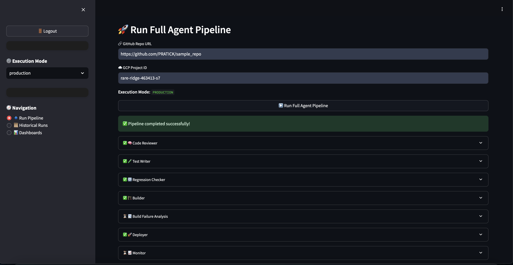

# 🧠 Azure AgentOps

**Azure AgentOps** is an AI-powered, multi-agent DevOps automation platform that streamlines the entire software delivery pipeline — from code review to deployment — using Microsoft Azure, Azure OpenAI, and Cosmos DB.

## 🚀 What It Does

Azure AgentOps automates 8+ critical DevOps steps:
- 🧠 **Code Review Agent** – Analyzes code structure, style, security, and best practices using Azure OpenAI.
- 🧪 **Test Writer Agent** – Generates missing unit tests and measures code coverage.
- 🔁 **Regression Checker Agent** – Runs real test suites and flags regression issues.
- 🏗️ **Builder Agent** – Builds and containers the application using Azure Container Registry.
- 🚀 **Deployer Agent** – Deploys apps to Azure Container Apps with rollback support.
- 📈 **Monitor Agent** – Detects health issues using Azure Monitor and Container Apps logs.
- ↩️ **Rollback Agent** – Automatically reverts deployments when anomalies are detected.
- 👷 **SRE Agent** – Synthesizes incidents and recommends infrastructure improvements.

## 🖥️ UI Features

- Built with **Streamlit**
- Sidebar-based navigation across agents
- Toggle between **simulation** and **production** modes
- View **historical pipeline runs**
- Azure Cosmos DB logging for full traceability
- Summary dashboard with run insights and agent stats

## 🧪 Test Coverage

- ✅ **23 tests passing**
- 📈 Current test coverage: **41%**
- CI runs on every commit via GitHub Actions

## 🛠️ Built With

- `Python`, `Streamlit`, `pytest`
- `Microsoft Azure (Container Apps, Container Registry, Monitor)`
- `Azure OpenAI (GPT-4 integration)`
- `Azure AD B2C + Cosmos DB`
- `Docker`, `GitHub API`, `subprocess`, `Azure CLI`

## 🔧 Built with Agent Development Kit (ADK)

Azure AgentOps was built using Google's **Agent Development Kit (ADK)** — a powerful framework for creating structured, LLM-driven agents that can reason, plan, and act autonomously.

I used ADK to:
- Design each AI agent using a modular `run()` interface
- Structure agent behavior into **thinking → acting → reasoning** phases
- Pass shared context between agents throughout the pipeline
- Standardize agent outputs with status, logs, and error handling
- Integrate cleanly with Azure Cosmos DB for logging and traceability

ADK helped me build intelligent agents that collaborate across DevOps tasks — turning abstract prompts into practical, production-ready actions.

## 🔐 Auth & Deployment

- Secure login via Azure AD B2C
- Deployed to **Azure Container Apps**
- GitHub PR trigger support (simulated & production-ready)

## 📁 Folder Structure

```
azure-agentops/
│
├── agents/                # All 8 AI agents
├── utils/                 # Shared helpers (Azure, GitHub, OpenAI)
├── tests/                 # Unit tests (22+ passing)
├── sections/              # Streamlit UI pages
├── main.py                # Streamlit app entrypoint
├── config.py              # Central config for simulation toggle
├── .gitignore             # Standard + Azure + Python
├── requirements.txt       # Dependencies
├── ci.yml                 # GitHub CI workflow
└── README.md              # You're reading it
```

## ✅ Getting Started

```bash
git clone https://github.com/yourusername/azure-agentops.git
cd azure-agentops
pip install -r requirements.txt

# Set up environment variables
cp .env.example .env
# Edit .env with your Azure credentials

streamlit run main.py
```

## 🌐 Environment Variables

Create a `.env` file with the following variables:

```env
# Azure OpenAI
AZURE_OPENAI_API_KEY=your_azure_openai_key
AZURE_OPENAI_ENDPOINT=https://your-resource.openai.azure.com/
AZURE_OPENAI_DEPLOYMENT_NAME=gpt-4
AZURE_OPENAI_API_VERSION=2024-02-15-preview

# Azure Cosmos DB
AZURE_COSMOS_ENDPOINT=https://your-cosmos.documents.azure.com:443/
AZURE_COSMOS_KEY=your_cosmos_key

# Azure AD B2C (optional)
AZURE_AD_TENANT_ID=your_tenant_id
AZURE_AD_CLIENT_ID=your_client_id
AZURE_AD_CLIENT_SECRET=your_client_secret

# Azure Resources
AZURE_SUBSCRIPTION_ID=your_subscription_id
AZURE_RESOURCE_GROUP=agentops-rg
AZURE_LOCATION=eastus
AZURE_CONTAINER_REGISTRY=agentopsregistry

# GitHub (for test writer agent)
GITHUB_TOKEN=your_github_token
```

## 🚀 Deployment

1. Set up Azure resources:
   ```bash
   # Create resource group
   az group create --name agentops-rg --location eastus
   
   # Create container registry
   az acr create --resource-group agentops-rg --name agentopsregistry --sku Basic
   
   # Create Cosmos DB account
   az cosmosdb create --name agentops-cosmos --resource-group agentops-rg
   
   # Create Azure OpenAI resource
   az cognitiveservices account create --name agentops-openai --resource-group agentops-rg --kind OpenAI --sku S0 --location eastus
   ```

2. Deploy to Azure Container Apps:
   ```bash
   # Build and push image
   az acr build --registry agentopsregistry --image azure-agentops:latest .
   
   # Create container app environment
   az containerapp env create --name agentops-env --resource-group agentops-rg --location eastus
   
   # Deploy container app
   az containerapp create \
     --name azure-agentops \
     --resource-group agentops-rg \
     --environment agentops-env \
     --image agentopsregistry.azurecr.io/azure-agentops:latest \
     --target-port 8501 \
     --ingress external
   ```

## 🧭 System Architecture

The system uses Azure services for a complete DevOps automation pipeline:

- **Azure Container Registry**: Stores Docker images
- **Azure Container Apps**: Hosts the application and deployed services
- **Azure OpenAI**: Powers the AI agents with GPT-4
- **Azure Cosmos DB**: Stores session logs and historical data
- **Azure Monitor**: Provides observability and logging
- **Azure AD B2C**: Handles authentication

## 📸 Screenshot



## 📜 License

MIT © [Your Name]

Azure AgentOps demonstrates the power of Microsoft Azure for AI-driven DevOps automation.