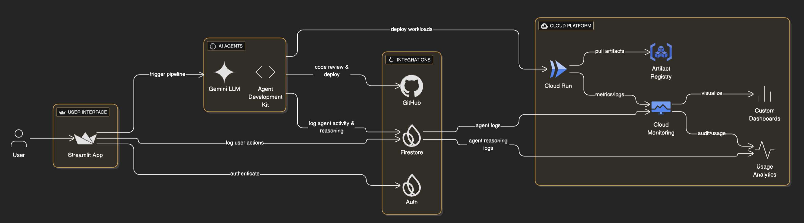

# 🧠 AgentOps

**AgentOps** is an AI-powered, multi-agent DevOps automation platform that streamlines the entire software delivery pipeline — from code review to deployment — using Google Cloud, Gemini, and Firestore.

## 🚀 What It Does

AgentOps automates 8+ critical DevOps steps:
- 🧠 **Code Review Agent** – Analyzes code structure, style, security, and best practices using Gemini.
- 🧪 **Test Writer Agent** – Generates missing unit tests and measures code coverage.
- 🔁 **Regression Checker Agent** – Runs real test suites and flags regression issues.
- 🏗️ **Builder Agent** – Builds and containers the application.
- 🚀 **Deployer Agent** – Deploys apps to GCP Cloud Run with rollback support.
- 📈 **Monitor Agent** – Detects health issues using GCP logs and metrics.
- ↩️ **Rollback Agent** – Automatically reverts deployments when anomalies are detected.
- 👷 **SRE Agent** – Synthesizes incidents and recommends infrastructure improvements.

## 🖥️ UI Features

- Built with **Streamlit**
- Sidebar-based navigation across agents
- Toggle between **simulation** and **production** modes
- View **historical pipeline runs**
- Firestore logging for full traceability
- Summary dashboard with run insights and agent stats

## 🧪 Test Coverage

- ✅ **23 tests passing**
- 📈 Current test coverage: **41%**
- CI runs on every commit via GitHub Actions

## 🛠️ Built With

- `Python`, `Streamlit`, `pytest`
- `Google Cloud (Cloud Run, Logging)`
- `OpenAI Gemini (LLM integration)`
- `Firebase Auth + Firestore`
- `Docker`, `GitHub API`, `subprocess`, `radon`

## 🔧 Built with Agent Development Kit (ADK)

AgentOps was built using Google’s **Agent Development Kit (ADK)** — a powerful framework for creating structured, LLM-driven agents that can reason, plan, and act autonomously.

I used ADK to:
- Design each AI agent using a modular `run()` interface
- Structure agent behavior into **thinking → acting → reasoning** phases
- Pass shared context between agents throughout the pipeline
- Standardize agent outputs with status, logs, and error handling
- Integrate cleanly with Firestore for logging and traceability

ADK helped me build intelligent agents that collaborate across DevOps tasks — turning abstract prompts into practical, production-ready actions.

## 🔐 Auth & Deployment

- Secure login via Firebase Auth
- Deployed to **GCP Cloud Run**
- GitHub PR trigger support (simulated & production-ready)

## 📁 Folder Structure

```
agentops-app/
│
├── agents/                # All 8 AI agents
├── utils/                 # Shared helpers (GCP, GitHub, Gemini)
├── tests/                 # Unit tests (22+ passing)
├── sections/              # Streamlit UI pages
├── main.py                # Streamlit app entrypoint
├── config.py              # Central config for simulation toggle
├── .gitignore             # Standard + GCP + Python
├── requirements.txt       # Dependencies
├── ci.yml                 # GitHub CI workflow
└── README.md              # You're reading it
```

## ✅ Getting Started

```bash
git clone https://github.com/yourusername/agentops.git
cd agentops-app
pip install -r requirements.txt
streamlit run main.py
```

## 🌐 Deployment

1. Set up Firebase (Auth + Firestore)
2. Enable Cloud Run & Logging APIs in GCP
3. Deploy to Cloud Run using:
   ```bash
   gcloud builds submit --tag gcr.io/your-project/agentops
   gcloud run deploy agentops --image gcr.io/your-project/agentops --platform managed
   ```

## 🧭 System Architecture



## 📜 License

MIT © [Your Name]
